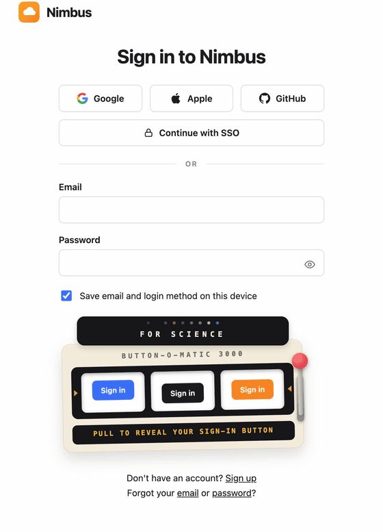
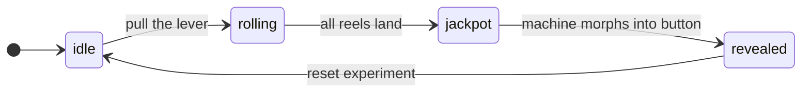
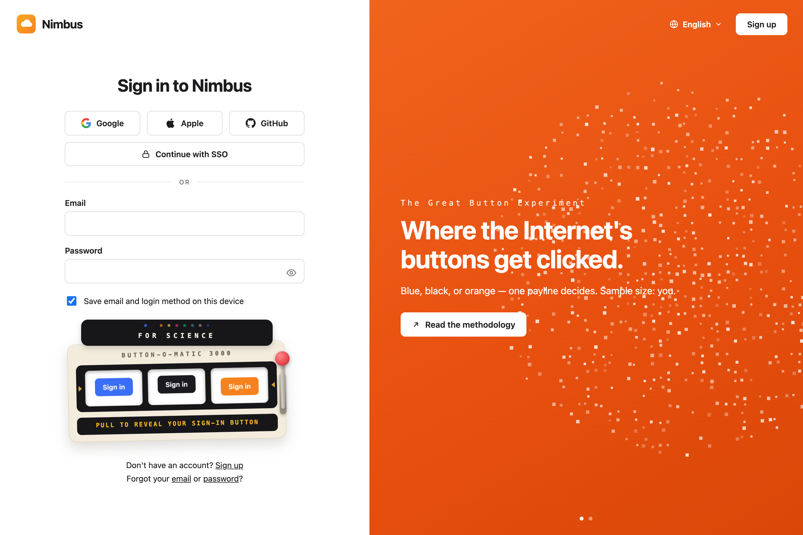

<div align="center">

# 🎰 react-button-o-matic

### BUTTON-O-MATIC 3000 — a slot-machine sign-in button for React

Why A/B test your button color when a slot machine can decide per visitor?

[](https://hasaneyldrm.github.io/react-button-o-matic/)
[](./LICENSE)
[](https://react.dev)
[](./package.json)
[](./package.json)

**[▶ Try the live demo](https://hasaneyldrm.github.io/react-button-o-matic/)**



</div>

---

Pull the lever → the reels spin through your button variants → all three land on the same one → **JACKPOT** → confetti → the machine morphs into a real, clickable sign-in button in the winning color. Every click is "recorded". Sample size: you. For science.

Inspired by [this tweet by @joshmanders](https://x.com/joshmanders/status/2085797355366809950) ("What if, and hear me out, Cloudflare... You make it fun?"), itself a reply to a Cloudflare engineer musing about measuring which sign-in button gets clicked the most. Not affiliated with Cloudflare in any way.

## Features

- 🎡 **Physics-feel reels** — every pull generates a fresh randomized strip per reel; fast start, long deceleration, overshoot settle with a thunk. Blur eases off right before landing so you see the final snap.
- 🕹️ **Springy lever** — pulls down, hangs a beat, springs back past zero. The knob bobs while idle so the machine begs to be pulled.
- 🎉 **Confetti burst** — launches up, tumbles down, ~90 pieces, different every time.
- 🪄 **Morph reveal** — the machine shrinks into the real button; the button pops in with a one-off shine sweep.
- 🎛️ **Everything is a prop** — variants, all copy, timings, palette, persistence, rigged outcomes, custom render.
- 🧩 **Composable** — `Marquee`, `Reel`, `Lever`, `RevealedButton`, `ConfettiBurst` are exported on their own.
- ♿ **Accessible** — real `<button>` lever, `aria-live` LCD, full `prefers-reduced-motion` support.
- 📦 **Zero dependencies** — just React. ESM + CJS + TypeScript types, ~6 kB gzipped with styles.

## Quick start

```bash
npm install react-button-o-matic
```

```tsx
import { ButtonOMatic } from 'react-button-o-matic'
import 'react-button-o-matic/style.css'

function LoginForm() {
  return (
    <form onSubmit={handleSubmit}>
      {/* email, password, ... */}
      <ButtonOMatic
        buttonType="submit"
        persistKey="my-app-button-experiment"
        onReveal={(winner) => track('button_variant', winner.id)}
        onButtonClick={(count, winner) => track('sign_in_click', { count, winner: winner.id })}
      />
    </form>
  )
}
```

That's it — state machine, lever, reels, LCD, confetti and the revealed button are all included.

## How it works



The winner is picked the moment you pull (uniform random by default), then every reel rolls through its own randomized sequence and decelerates onto it — so it always jackpots, just like the best rigged science.

## Everything is dynamic

```tsx
<ButtonOMatic
  variants={[
    { id: 'purple', background: '#7c3aed' },
    { id: 'teal', background: '#0d9488' },
    { id: 'pink', background: '#db2777', label: 'Let me in' },
  ]}
  buttonLabel="Log in"
  marqueeText="NO MORE MEETINGS"
  machineName="LOGIN-TRON 9000"
  idleText="PULL TO REVEAL YOUR LOGIN BUTTON"
  rollingText="CONSULTING THE ALGORITHM…"
  jackpotText={({ winner }) => `WINNER — ${winner.id.toUpperCase()}`}
  winnerText={({ winner }) => `the reels chose ${winner.id}.`}
  clicksText={({ count }) => `${count} clicks and counting.`}
  resetText="spin again"
  reels={3}
  spinDuration={1500}
  reelStagger={600}
  jackpotDuration={1500}
  winnerId="teal" // rig the outcome
/>
```

## Props

| Prop | Type | Default | Description |
| --- | --- | --- | --- |
| `variants` | `ButtonOMaticVariant[]` | blue / black / orange | Button variants loaded in the reels. `{ id, background, color?, label? }` |
| `buttonLabel` | `string` | `"Sign in"` | Label on reel buttons and the revealed button |
| `marqueeText` | `string` | `"FOR SCIENCE"` | Text on the black marquee |
| `machineName` | `string` | `"BUTTON-O-MATIC 3000"` | Model name on the machine body |
| `reels` | `number` | `3` | Number of reels |
| `idleText` | `string` | `"PULL TO REVEAL YOUR SIGN-IN BUTTON"` | LCD copy while idle |
| `rollingText` | `string` | `"ROLLING…"` | LCD copy while spinning |
| `jackpotText` | `string \| ({ winner }) => string` | `` `JACKPOT — ${id} SHIPS` `` | LCD copy on jackpot |
| `winnerText` | `string \| ({ winner }) => string` | `` `winner: ${id}. your click counts.` `` | Caption under the revealed button |
| `clicksText` | `string \| ({ count, winner }) => string` | `` `n=${count} clicks recorded — for science.` `` | Caption once clicked |
| `resetText` | `string \| null` | `"reset experiment"` | Reset link label; `null` hides it |
| `leverLabel` | `string` | `"Pull the lever"` | Accessible label for the lever |
| `winnerId` | `string` | — | Rig the outcome to a variant id |
| `pickWinner` | `(variants) => string` | uniform random | Custom winner picker |
| `spinDuration` | `number` | `1500` | ms before the first reel lands |
| `reelStagger` | `number` | `600` | ms between reels landing |
| `jackpotDuration` | `number` | `1500` | ms the celebration holds before the morph |
| `confetti` | `boolean` | `true` | Confetti on jackpot |
| `confettiColors` | `string[]` | variant colors + festive extras | Confetti palette |
| `persistKey` | `string` | — | Persist outcome + clicks in `localStorage` |
| `buttonType` | `"button" \| "submit"` | `"button"` | `type` of the revealed button |
| `disabled` | `boolean` | `false` | Disable the whole machine |
| `onPull` | `() => void` | — | Lever pulled |
| `onReveal` | `(winner) => void` | — | Reels settled on a winner |
| `onButtonClick` | `(count, winner) => void` | — | Revealed button clicked |
| `onReset` | `() => void` | — | Experiment reset |
| `renderRevealed` | `({ winner, count, click, reset }) => ReactNode` | — | Full control over the revealed state |
| `className` / `style` | — | — | Passed to the root element |

## Theming

The look is driven by CSS custom properties on the root `.bom` class — override any of them from your stylesheet or the `style` prop:

```css
.bom {
  --bom-machine-bg: #ffe9f0;   /* machine body */
  --bom-marquee-bg: #2b0a3d;   /* marquee + LCD + reel housing */
  --bom-lcd-color: #ff7ac6;    /* LCD text + paylines */
  --bom-knob: #7c3aed;         /* lever knob */
  --bom-glow: #db2777;         /* jackpot glow + focus ring */
  --bom-reel-h: 72px;          /* reel window height */
  --bom-radius: 18px;
}
```

See [`src/lib/button-o-matic.css`](./src/lib/button-o-matic.css) for the full list.

## Composable parts

`ButtonOMatic` is a thin orchestrator over small components you can also import directly:

```tsx
import {
  ButtonOMatic,   // the whole machine
  Marquee,        // blinking-dot sign
  Reel, ReelCell, // one spinning reel
  Lever,          // the arm with the red knob
  RevealedButton, // winner button + caption + reset
  ConfettiBurst,  // celebration overlay
  DEFAULT_VARIANTS,
} from 'react-button-o-matic'
```

## Accessibility

- The lever is a real `<button>`: keyboard operable, focusable, `aria-label`ed.
- The LCD is `role="status"` with `aria-live="polite"` — screen readers hear `ROLLING…` and the jackpot result.
- Under `prefers-reduced-motion` the show collapses into a quick, blur-free, confetti-free reveal.

## Demo

<div align="center">
<a href="https://hasaneyldrm.github.io/react-button-o-matic/"></a>
</div>

The repo ships a full demo page recreating the login screen from the original video — [live here](https://hasaneyldrm.github.io/react-button-o-matic/), auto-deployed from `main` by GitHub Actions. To run it locally:

```bash
npm install
npm run dev
```

## License

[MIT](./LICENSE) — pull responsibly.
